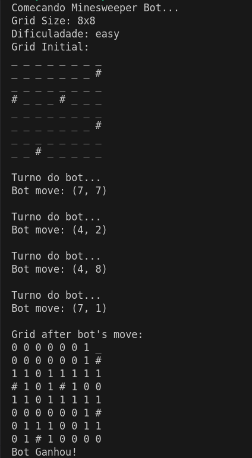

# Campo Minado

**Disciplina**: FGA0210 - PARADIGMAS DE PROGRAMAÇÃO - T01 <br>
**Nro do Grupo**: 4<br>
**Paradigma**: Funcional<br>

## Alunos
|Matrícula | Aluno |
| :--: | :--: |
| 20/2045624 | [Abdul hannan](https://github.com/hannanhunny01)	|
| 21/1029147 | [Arthur de Melo Viana](https://github.com/arthurmlv)	|
| 19/0026758 | [Deivid Carvalho](https://github.com/deivid-a1) |	
| 21/1062867 | [Felipe de Jesus Rodrigues](https://github.com/felipeJRdev) |
| 17/0108341 | [Levi de Oliveira Queiroz](https://github.com/LeviQ27) |	
| 17/0111059 | [Matheus Fonseca Sousa](https://github.com/gatotabaco) |	
| 19/0093331 | [Matheus Costa Gomes](https://github.com/mc-gomes) |	
| 21/2005444 | [Pedro fonseca Cruz]()	|
| 21/1029559 | [Rafael Brito Bosi Rodrigues](https://github.com/StrangeUnit28) |	
| 16/0149410 | [Yudi Yamane de Azevedo](https://github.com/yudi-azvd)	| 


## Sobre 

Este projeto é uma implementação do popular jogo de campo minado, feita com o foco em explorar as potencialidades do paradigma funcional e da linguagem Haskell. Ao abordar a estrutura do jogo, foi usada uma abordagem modular, com funções que aproveitam o sistema de tipos forte e a pureza de Haskell, características que tornam a linguagem ideal para implementações claras e rigorosas.

Neste projeto, você encontrará uma aplicação robusta e funcional, com recursos que vão desde a geração dinâmica de grids com bombas e contagem de células adjacentes, até a manipulação de dados e a navegação interativa do jogador, tudo executado em uma interface gráfica construída com a biblioteca h-raylib (baseada na raylib).

Para quem deseja explorar o funcionamento do projeto, ele foi estruturado de modo a oferecer:

Um modelo extensível de nós e grids: onde cada célula do grid possui atributos específicos que controlam seu estado (visibilidade, presença de bandeiras, bombas, etc.).
Algoritmos de busca (BFS e DFS): utilizados para explorar o campo e abrir regiões de células, refletindo o comportamento do jogo real.
Registro de tempo de partida e contagem de movimentos: para aqueles que gostam de melhorar o desempenho em cada tentativa.
O código, implementado inteiramente em Haskell, não apenas foca em eficiência e segurança, como também serve como uma ótima fonte de aprendizado para quem quer compreender conceitos do paradigma funcional aplicados em um projeto completo.

Interessados em Haskell ou na lógica de campo minado podem explorar o código e a estrutura modular deste projeto. Ele está organizado para ser amigável a contribuições e inclui documentação interna para aqueles que desejarem mergulhar mais fundo em cada função.

Para saber mais sobre Haskell e a biblioteca raylib usada na interface gráfica, confira:

- [Documentação Haskell](https://www.haskell.org/documentation/)
- [raylib](https://www.raylib.com/) e [h-raylib](https://github.com/Anut-py/h-raylib/blob/master/DOCUMENTATION.md) no GitHub

Este projeto é aberto a sugestões e contribuições. Sinta-se à vontade para contribuir com melhorias, adicionar novos recursos ou simplesmente compartilhar feedback.


## Screenshots
Adicione 2 ou mais screenshots do projeto em termos de interface e/ou funcionamento.

## Execução
**Linguagens**: [Haskell](https://www.haskell.org/downloads/)

**Tecnologias**: [Cabal](https://www.haskell.org/cabal/), [Raylib](https://www.raylib.com/)

### Pré-requisitos

Clone este repositório em seu ambiente local:
```bash
git clone <URL_DO_REPOSITORIO>
cd 2024.2_G4_Funcional_CampoMinado
```

Certifique-se de ter o Haskell instalado. Para verificar, execute:
```bash
ghc --version
```

O Cabal geralmente é incluído com a instalação do Haskell, mas caso não esteja disponível, instale-o conforme as instruções no site do Haskell: [Haskell.org](https://www.haskell.org/).

### Dependências
- Cabal 3.10.3
- GHC 9.6.6
- GHCUP 0.1.30.0 (opcional)
- Raylib (através do pacote h-raylib)
- base 4.18 && < 4.19

### h-raylib
Para instalação das dependências do h-raylib, consulte a documentção 
[Platform specific requirements](https://hackage.haskell.org/package/h-raylib-5.5.2.1#platform-specific-requirements).

### Executando o Projeto no Windows

Instale as dependências e compile o projeto usando:

```bash
cabal build
```

Após a construção do projeto, execute o jogo com o comando:
```bash
cabal run CampoMinado
```

Para rodar no modo bot, execute:
```bash
cabal run CampoMinadoBot
```

### Executando o Projeto no Linux e macOS

Execute o comando a seguir para instalar Haskell e Cabal:

```bash
sudo apt-get install haskell-platform  # Para Linux (Debian/Ubuntu)
brew install ghc cabal-install          # Para macOS com Homebrew
```

Compile o projeto e instale as dependências com:
```bash
cabal build
```

Após o build, inicie o jogo com:
```bash
cabal run CampoMinado
```

Para rodar no modo bot, execute:
```bash
cabal run CampoMinadoBot
```

### Problemas Comuns
- Caso enfrente erros de compilação, verifique se as versões do GHC e Cabal estão atualizadas.
- Consulte a documentação oficial para resolver dependências específicas de pacotes Haskell.

Com essas instruções, você deve estar pronto para compilar e jogar Campo Minado no Haskell!


## Uso 

Este guia de uso do Campo Minado em Haskell mostra como iniciar e jogar o projeto, com uma visão detalhada das telas e passos necessários. Para começar, basta seguir os passos abaixo:

### Passo 1: Executar o Projeto
No terminal, execute o comando:

```bash
cabal run CampoMinado
```
Esse comando compila e executa o projeto. Em seguida, a interface gráfica será aberta e o jogo será iniciado.


### Passo 2: Seleção da Estrutura de Busca
A primeira tela exibida permitirá que você escolha a estrutura de busca para o jogo. Esta configuração define a forma como o campo é explorado, com opções como BFS (busca em largura) e DFS (busca em profundidade).


Escolha a estrutura desejada para prosseguir para a próxima etapa.

### Passo 3: Escolher o Tamanho do Grid
Na próxima tela, defina o tamanho do grid (tabuleiro) em que o jogo será jogado. Escolha o tamanho de acordo com sua preferência e habilidade. Um grid maior oferece um desafio mais extenso, enquanto um menor é mais rápido de explorar.


### Passo 4: Seleção da Dificuldade
Após definir o tamanho do grid, será exibida a tela de seleção de dificuldade, com opções como Fácil, Normal e Difícil. Essa configuração ajusta o número de bombas no campo, tornando o jogo mais ou menos desafiador.


### Passo 5: Início do Jogo
Agora, o jogo está pronto para começar! Ao iniciar o jogo, um cronômetro no canto superior esquerdo da tela marca o tempo decorrido desde o início, adicionando um elemento de desafio adicional.


### Como Jogar

- Selecionar Célula: Clique com o botão esquerdo do mouse para abrir uma célula. Se a célula contiver uma bomba, o jogo termina, revelando todas as bombas no campo.
- Colocar Bandeira: Clique com o botão direito do mouse para marcar uma célula com uma bandeira, indicando onde você acredita que há uma bomba. Clique novamente com o botão direito para remover a bandeira.


### Passo 6: Fim de Jogo
O jogo termina de duas maneiras:

- Vitória: Quando todas as células livres são abertas sem explodir nenhuma bomba, uma mensagem de vitória aparece na tela.
- Derrota: Se uma célula com bomba é selecionada, uma mensagem de derrota aparece, e todas as bombas são reveladas.

Em ambos os casos, duas opções são exibidas para o usuário:

- Reiniciar: Comece uma nova partida com as mesmas configurações (estrutura de busca, tamanho do grid e dificuldade).
- Menu Inicial: Retorne à tela inicial de seleção de estrutura de busca para começar um novo jogo com configurações diferentes.


### Rodando Bot

Para rodar o Bot basta escrever o seguinte comando no terminal:

```bash
cabal run CampoMinadoBot
```


Depois de executar o comando, o output do código será algo como:



O Bot tenta resolver o Campo Minado utilizando probabilidade.


## Vídeo
Vídeo com a explicação e execução do projeto:
[Apresentação](https://www.youtube.com/watch?v=9lC8M_Gmg50)


## Participações
Apresente, brevemente, como cada membro do grupo contribuiu para o projeto.

|       Nome do Membro        | Contribuição                                                                 | Significância da Contribuição para o Projeto (Excelente/Boa/Regular/Ruim/Nula) | Comprobatórios (ex. links para commits) |
| :-------------------------: | ---------------------------------------------------------------------------- | :----------------------------------------------------------------------------: | :-------------------------------------: |
|           Fulano            | Programação dos Fatos da Base de Conhecimento Lógica                         |                                      Boa                                       |          Commit tal (com link)          |
| Abdul hannan |    Criação do documento Guia.md para detalhar e explicar melhor todos os módulos e funções do projeto e criacao do bot de toma decisões basedo nas probabilidades, escolhendo células com menor risco (<0.3) e usa BFS para explorar células| Excelente   |   |
|    Arthur de Melo Viana     | Implementação da BFS Recursiva e da estrutura base do grafo e dos nós e de funções básicas para a grid como o contador de bombas adjacentes à celula e updates nos nós. Implementação das telas de fim de jogo e da visualização das bombas ao ganhar/perder.     |  Excelente | [Versão Inicial das Estruturas e da BFS](https://github.com/UnBParadigmas2024-2/2024.2_G4_Funcional_CampoMinado/commit/93f5b069567541163f32634e51ec0ee852c60bf8), [Implementação e correção da BFS recursiva](https://github.com/UnBParadigmas2024-2/2024.2_G4_Funcional_CampoMinado/commit/a2694f0995dc957ddb1e48410b8205cdc3a4f544) e [Adiciona telas de fim de jogo e revelação das bombas na interface](https://github.com/UnBParadigmas2024-2/2024.2_G4_Funcional_CampoMinado/pull/17/commits/a3223e69b95db2e32404163af45dc34a2b278228) |
|       Deivid Carvalho       |   |  |   |
| Felipe de Jesus Rodrigues |  Geração de bombas aleátoria para cada dificuldade e tamanho de tabuleiro. Tela de seleção de dificuldade.  |  Excelente  | [Geração de bombas aleátoria para cada dificuldade e tamanho de tabuleiro](https://github.com/UnBParadigmas2024-2/2024.2_G4_Funcional_CampoMinado/commit/8d3282f7ae9a6ec657430fa2202ea882dfea59fd); [Tela de seleção de dificuldade](https://github.com/UnBParadigmas2024-2/2024.2_G4_Funcional_CampoMinado/commit/96f9fb93655bc39be974079a1527b9b75176fa8c) |
|  Levi de Oliveira Queiroz   |  Implementação do botão de Menu Inicial no fim do jogo e a parada do cronômetro                                                                            |   Regular                                                                             |   [Time stop when player lose or win](https://github.com/UnBParadigmas2024-2/2024.2_G4_Funcional_CampoMinado/commit/232116c396fc99c7f8874eb1f5bffabb3e109b37) <br> [Menu Inicial returns to SetStructureMenu](https://github.com/UnBParadigmas2024-2/2024.2_G4_Funcional_CampoMinado/commit/683df7d89eab6ec35f74da5cf52a978a407c044c)                                     |
|    Matheus Fonseca Sousa    |    Implementação das interações com mouse na interface do projeto utilizando algumas funções da biblioteca Raylib  | Boa |   [fc55305](https://github.com/UnBParadigmas2024-2/2024.2_G4_Funcional_CampoMinado/commit/fc55305cf02c9b3078a1ebd669e9830a0f04d7e8) |                                                       |                                         |
|     Matheus Costa Gomes     | Implementação da funcionalidade de inserir bandeira e organização de código  |  Excelente  | [PR #5](https://github.com/UnBParadigmas2024-2/2024.2_G4_Funcional_CampoMinado/pull/5) <br> [PR #11](https://github.com/UnBParadigmas2024-2/2024.2_G4_Funcional_CampoMinado/pull/11)  |	
| Pedro fonseca Cruz          |                                                                              |                                                                                |                                         |
| Rafael Brito Bosi Rodrigues | Implementação da DFS para busca dos nós por meio de uma estrutura de pilha, implementação das telas de seleção de estrutura e tamanho de grid | Excelente |  [2dc4047](https://github.com/UnBParadigmas2024-2/2024.2_G4_Funcional_CampoMinado/commit/2dc404706ade9381073bbcaab5b31ec6b4dcccd1)<br>[6adef38](https://github.com/UnBParadigmas2024-2/2024.2_G4_Funcional_CampoMinado/commit/6adef3884914a3cd77b3cd1539e486ee11b9b00b)<br>[74e39b3](https://github.com/UnBParadigmas2024-2/2024.2_G4_Funcional_CampoMinado/commit/74e39b3b9ba5a51f1d1e8d2266cfd01e52ced112)|
|   Yudi Yamane de Azevedo    | Setup projeto com Raylib, renderização da grade de acordo com o estado do nó |                                      Excelente                                       |            [1ccffce](https://github.com/UnBParadigmas2024-2/2024.2_G4_Funcional_CampoMinado/commit/1ccffceb1186b3d9fbcff0c66a690cc7074c153f), [b292060](https://github.com/UnBParadigmas2024-2/2024.2_G4_Funcional_CampoMinado/commit/b292060a043fd68fa13040a5df1e4f9bb7767a93)             |


## Outros 

### Projeto Campo Minado em Haskell

Este projeto, desenvolvido em Haskell com a biblioteca gráfica raylib, implementa o jogo de Campo Minado explorando o paradigma funcional. Durante o desenvolvimento, aprofundamos nossa compreensão sobre as vantagens e desafios da programação funcional, especialmente no contexto de manipulação de estados e recursão, características centrais no Haskell.

### Lições Aprendidas
Ao longo do projeto, aprendemos a aproveitar o poder das funções puras e da imutabilidade, características que tornam o código mais previsível e seguro, apesar da complexidade que essa abordagem pode trazer em jogos interativos. Compreendemos melhor o uso de funções de alta ordem e como a ausência de efeitos colaterais facilita o teste e a verificação de nosso código.

### Percepções
Notamos que a implementação de algoritmos como DFS (usando pilhas) e BFS (usando filas) em um ambiente funcional pode exigir uma abordagem diferente daquela que faríamos em paradigmas imperativos, o que tornou o desenvolvimento desafiador e instigante. Haskell nos incentivou a pensar de forma diferente, buscando resolver problemas com elegância funcional.

### Contribuições e Fragilidades
Cada membro contribuiu significativamente para a conclusão do projeto. Contudo, tivemos dificuldades em alinhar os horários para reuniões, o que impactou na integração dos códigos desenvolvidos individualmente e no entendimento conjunto de algumas partes da lógica. Esse desafio acabou gerando algum retrabalho, mas também reforçou a importância da comunicação e da coordenação em equipes de desenvolvimento.

### Trabalhos Futuros
Para o futuro, planejamos otimizar os algoritmos de busca e explorar novas abordagens para a resolução do jogo, podendo incluir a implementação de um tipo diferente de busca. Além disso, estamos estudando formas de melhorar a performance geral do projeto e a interação entre os diferentes módulos funcionais.

### Mais Detalhes
Para um guia completo de módulos, funções, e organização do projeto, consulte nosso [guia.md](guia.md), onde descrevemos as funções e a arquitetura do projeto em maior profundidade.

## Fontes

- [Exemplo de imagem h-raylib](https://github.com/Anut-py/h-raylib/tree/master/examples/basic-images)
- [Assets do Campo Minado](https://github.com/BrandonDusseau/minesweeper-classic)
- [Asset do Botão](https://pauboeg.itch.io/ui-starter-pack?download)
